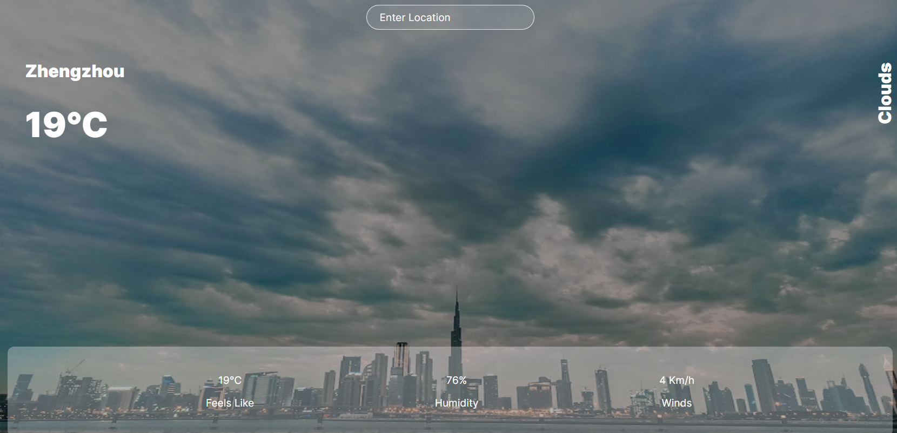

# Sunshine-Stats Weather Website

The Sunshine-Stats Weather website is a user-friendly weather application that provides real-time weather information for locations around the world. With a sleek and intuitive interface, users can easily search for their desired location and view detailed weather data, including temperature, description, humidity, wind speed, and more.

## **Features**

- **Location-based Weather:** Enter the name of any city to get up-to-date weather information for that location.
- **Dynamic Background:** The background image of the website changes based on the current weather conditions, creating a visually appealing and immersive experience.
- **Responsive Design:** The website is designed to be responsive, ensuring a seamless experience across different devices and screen sizes.
- **User-friendly Interface:** The intuitive interface makes it easy for users to search for locations, view weather details, and navigate through the website effortlessly.

## **Possible Applications**

The Sunshine-Stats Weather website can be used in various contexts, including:

1. **Travel Agencies:** The website can serve as an attractive front page for travel agencies, providing visitors with a glimpse of the current weather conditions in popular travel destinations.
2. **Tourism Websites:** Incorporating the weather information into tourism websites can enhance the user experience by helping travelers plan their trips accordingly.
3. **Outdoor Event Planners:** Event organizers can utilize the website to check the weather conditions for specific dates and locations, ensuring optimal planning and preparation. (Obs.: The API used now is a free mode with single search but it can be implemented easy with a paid API with more informations).
4. **Personal Use:** Individuals can use the website as a go-to weather application for checking weather updates and forecasts before planning outdoor activities or travel.

## **Technologies Used**

The Sunshine-Stats Weather website is built using modern web technologies, including:

- React: A popular JavaScript library for building user interfaces.
- HTML: The standard markup language for creating web pages.
- CSS: The styling language used to design the website layout and appearance.
- OpenWeatherMap API: The API used to fetch real-time weather data for different locations.

## **Getting Started**

To run the Sunshine-Stats Weather website locally, follow these steps:

1. Clone the repository: git clone https://github.com/your-repo-url
2. Navigate to the project directory: cd sunshine-stats-weather
3. Install dependencies: npm install
4. Start the development server: npm start
5. Open your browser and visit: http://localhost:3000
   **Note:** You will need to obtain an API key from OpenWeatherMap and update it in the code to fetch weather data successfully.

# **Credits**

The Sunshine-Stats Weather website was developed by Lev Meir as a showcase project. The design and inspiration for this project were influenced by various weather applications and UI/UX design trends.

# **License**

This project is licensed under the MIT License. Feel free to modify and adapt it to suit your needs.

---

We hope you find the Sunshine-Stats Weather website informative and enjoyable to use. Whether you're planning a trip, organizing an event, or simply curious about the weather, this website offers a seamless experience to keep you informed about the latest weather conditions.
